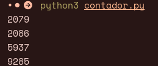

# PL2025 - TPC1

## Autor

**Nome:** André Carvalho

**ID:** A100818

## Descrição
O objetivo deste TPC é ler uma string e somar sequências de digitos, quando o programa encontra a string "off" no meio da string inicial ele deve parar de somar caracteres, contrariamente, quando encontra a string "on" deve retomar a soma. Por fim se encontrar o caracter "=" deve imprimir o resultado  

O programa foi testado utilizando uma string onde o output esperado é 2079, 2086, 5937, 9285.

Para testar com outras strings é apenas necessário mudar o valor da variável "texto" encontrada no ficheiro contador.py

## Como executar
`python3 contador.py`

## Resultados obtidos
