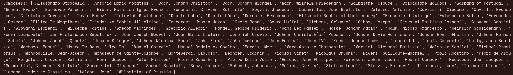
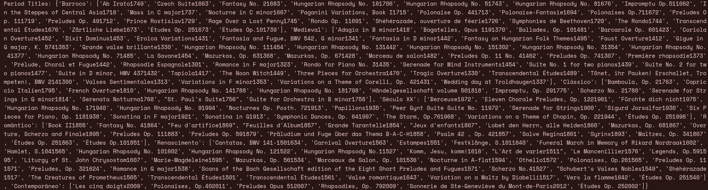

# PL2025 - TPC2

## Autor

**Nome:** André Carvalho

**ID:** A100818

## Descrição
O objetivo deste TPC é ler um dataset, processá-lo e extrair diversos dados, como por exemplo os compositores, a quantidade de obras por cada período e ainda criar um dicionário com todos os títulos de um determinado período

## Como executar
`python3 music.py < obras.csv`

## Resultados obtidos

