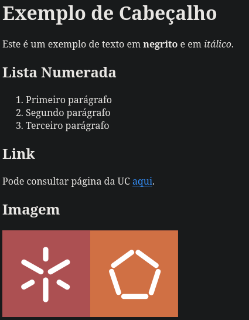

# PL2025 - TPC2

## Autor

**Nome:** André Carvalho

**ID:** A100818

## Descrição

O objetivo deste TPC criar um pequeno conversor de MarkDown para HTML em Python para os elementos descritos na "Basic Syntax", nomeadamente cabeçalhos, negrito, itálico, lista numerada, link e imagem.

Para a realização deste trabalho foram utilizadas as expressões regulares abordadas nas aulas.

## Como executar
`python3 mdToHtml.py < input.md`

## Resultados obtidos
