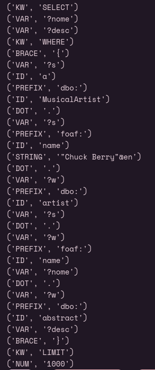

# PL2025 - TPC4

## Autor

**Nome:** André Carvalho

**ID:** A100818

## Descrição

O objetivo deste TPC foi construir um analisador léxico para uma linguagem de query, este deve ser capaz de identificar as diferentes operações dessa linguagem (Ex: Select, Where...), bem como identificadores, atribuições e números.

## Como executar
`python3 analex.py`

## Resultados obtidos
