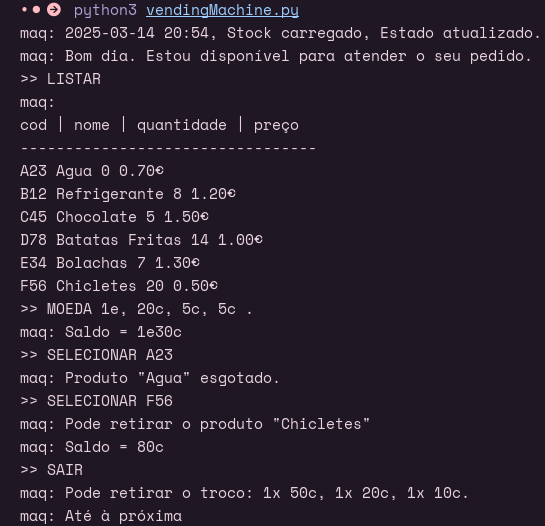

# PL2025 - TPC5

## Autor

**Nome:** André Carvalho

**ID:** A100818

## Descrição

Neste TPC o objetivo era construir uma máquina de venda automática. Ela deve carregar o stock em memória quando o programa é executado e atualizado quando é encerrado. O stock consiste um ficheiro json que armazena triplos, nome do produto, quantidade e preço. Esta máquina deve ser capaz de atender aos seguintes pedidos: 
- LISTAR
- MOEDA [moeda1, moeda2, ...].
- SELECIONAR [id do produto]
- SAIR

As moedas são processadas no formato 2e, 1e, 50c, 20c, 10c, 5c, 2c e 1c e o troco deve ser devolvido em moedas.

## Como executar
`python3 vendingMachine.py`

## Resultados obtidos
