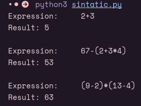

# PL2025 - TPC6

## Autor

**Nome:** André Carvalho

**ID:** A100818

## Descrição

Para este TPC é necessário implementar um simples interpretador que reconheça expressões aritméticas através do desenvolvimento de uma gramática independente de contexto LL(1), capaz de interpretar expressões do seguinte tipo:
- 2+3
- 67-(2+3*4)
- (9-2)*(13-4)
## Como executar
`python3 sintatic.py`

## Resultados obtidos
